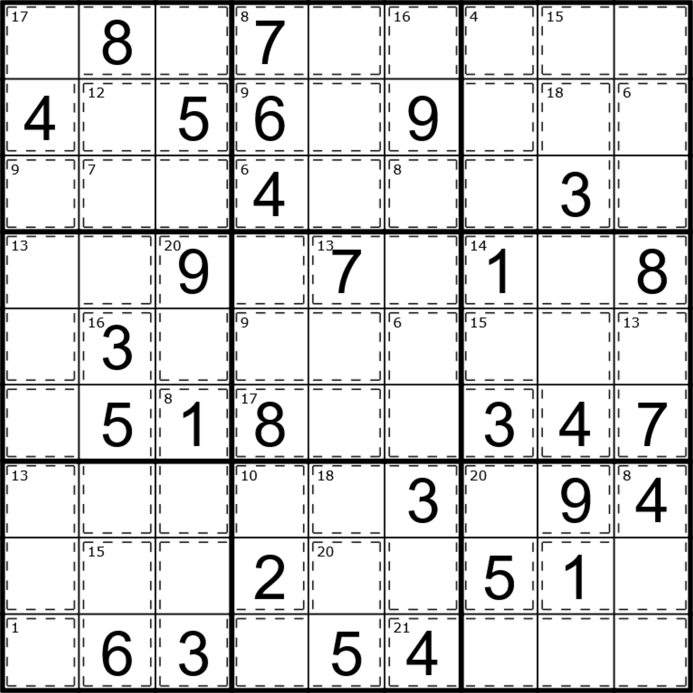
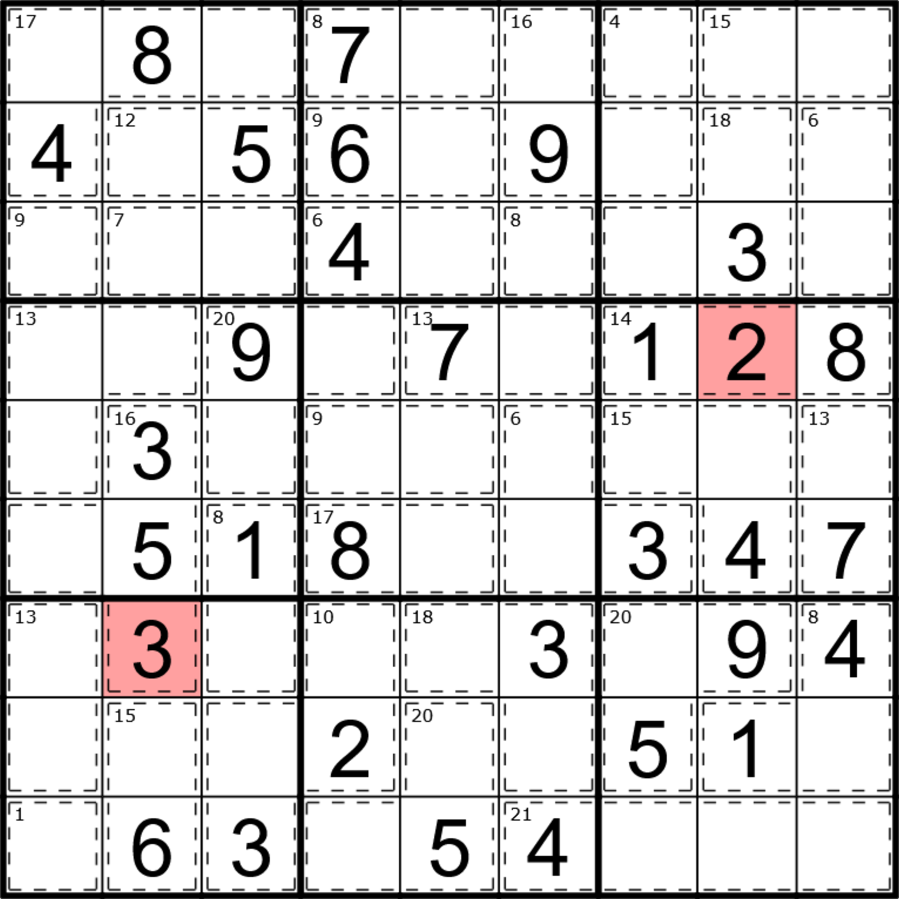

# Killer Sudoku Solver

In deze taak implementeren we een Killer Sudoku-solver.

## Wat is een Killer Sudoku?

Killer Sudoku is een puzzel die de regels van Sudoku combineert met extra beperkingen. Het doel is om een 9×9 rooster in te vullen met de cijfers 1 tot en met 9, zodat elk cijfer precies één keer voorkomt in elke rij, kolom en 3x3-vierkant. Daarnaast zijn er ook "killing cages". Net zoals een rij, kolom of vierkant, mag in iedere killing cage elk cijfer maar één keer voorkomen. Bij een killing cage is er echter ook een extra beperking: de som van de cijfers in die cage moet gelijk zijn aan een gegeven waarde. 

Eigenlijk kan een rij, kolom of vierkant ook als een killing cage worden beschouwd, maar in dit geval is de som van de cijfers in die rij, kolom of vierkant altijd 45. Wanneer we over zo een gebied spreken, of het nu een rij, kolom, vierkant of killing cage is, noemen we het een "huis." Elke cel van het rooster is steeds deel van precies één killing cage.

## Voorbeeld
Hieronder zie je een voorbeeld van een Killer Sudoku. Killing cages zijn met behulp van streepjes-lijnen aangeduid.



Als we deze manueel zouden oplossen, zouden we bijvoorbeeld kunnen beginnen door in de vierde rij, in de killing cage met de 1 en de 8, de ontbrekende 5 in te vullen. Dit kan omdat de som van de cijfers in die cage 14 moet zijn, en $1+5+8=14$.

## Voorstelling

We kunnen een Killer Sudoku voorstellen door een JSON-object met twee velden:

- `given`: een lijst van objecten die de cellen voorstellen die al ingevuld zijn. Elk object heeft de velden `row`, `col` en `value`.
- `cages`: een lijst van objecten die de cages voorstellen. Elke cage heeft een lijst van cellen `cells`, waarbij elke cel een object is met de velden `row` en `col`, en een veld `sum` dat de som van de cijfers in die cage voorstelt.

Hieronder zie je een voorbeeld van een Killer Sudoku in JSON-formaat. Niet alle cages zijn gegeven hier, om plaats te besparen. Je kan zelf [sudoku-easy.json](./sudoku-easy.json) bekijken voor de volledige versie van de puzzel uit de afbeelding hierboven. 

```json
{
    "given": [
        { "row": 0, "col": 1, "value": 8 },
        { "row": 0, "col": 3, "value": 7 },
        { "row": 1, "col": 0, "value": 4 },
        { "row": 1, "col": 2, "value": 5 },
        /* ... meer cellen ... */
        { "row": 8, "col": 7, "value": 7 }
    ],
  "cages": [
    {
      "cells": [
        { "row": 0, "col": 0 },
        { "row": 0, "col": 1 },
        { "row": 0, "col": 2 },
        { "row": 1, "col": 0 }
      ],
      "sum": 17
    },
    {
      "cells": [
        { "row": 0, "col": 3 },
        { "row": 0, "col": 4 }
      ],
      "sum": 8
    },
    /* ... meer cages ... */
    {
      "cells": [
        { "row": 8, "col": 5 },
        { "row": 8, "col": 6 },
        { "row": 8, "col": 7 },
        { "row": 8, "col": 8 }
      ],
      "sum": 21
    }
  ]
}
```

**Let op:** In de JSON-bestanden zijn de rijen en kolommen genummerd van $0$ tot $8$. Dit betekent dat de eerste rij en kolom $0$ zijn, de tweede rij en kolom $1$, enzovoort. Wanneer we over rijen en kolommen spreken in de rest van deze opdracht, gebruiken we ook deze nummering.

## Opdracht

Schrijf een command-line programma in Rust. Het ondersteunt drie commando's, met de volgende syntaxis:

```bash
$ sudoku-solver <SUDOKU> <COMMANDO> [ARGUMENTEN]
```

- `<SUDOKU>`: het pad naar een JSON-bestand dat de Killer Sudoku voorstelt.
- `<COMMANDO>`: een van de volgende commando's:
  - `print`: print de Killer Sudoku in een mooi formaat.
  - `test`: test of de Killer Sudoku geldig is.
  - `solve`: los de Killer Sudoku op en print het resultaat.
- `[ARGUMENTEN]`: optionele argumenten, afhankelijk van het commando.
  - `print`: geen extra argumenten.
  - `test`: geen extra argumenten.
  - `solve`:
    - `-o` of `--output` gevolgd door een pad naar een bestand. Dit bestand zal de oplossing van de Killer Sudoku bevatten, in hetzelfde JSON-formaat als het invoerbestand.
    - `--seq` werkt altijd sequentieel, zonder parallelisme.

Het is verplicht [`clap`](https://crates.io/crates/clap) te gebruiken om de command line interface te maken. Gebruik de `derive` features van `clap` om dit te doen.

### `print` commando

Print de sudoku uit. Groepeer de cellen in 3x3-vierkanten, gescheiden door een lege regel en een spatie. Niet-ingevulde cellen worden weergegeven met een punt (.) en de cellen die al ingevuld zijn, worden weergegeven met hun waarde. De killing cages worden niet weergegeven.

```bash
$ sudoku-solver sudoku-easy.json print
.8.  7..  ...
4.5  6.9  ...
..6  4..  .3.

..9  .7.  1.8
.3.  ...  ...
.51  8..  347

...  ..3  .94
...  2..  51.
.63  .54  .7.
```

### `test` commando

Dit commando werkt identiek aan `print`, maar elke cel die tot een huis behoort dat niet geldig is, wordt weergegeven met een X. We zeggen dat een huis ongeldig is als:

1. Een cijfer meer dan één keer voorkomt in dat huis.
2. Of het huis volledig is ingevuld, maar de som van de cijfers in dat huis niet gelijk is aan de opgegeven waarde.
3. Of de som van de cijfers in dat huis groter is dan de opgegeven waarde.

Voor de voorbeeldpuzzel zou de uitvoer identiek zijn aan de uitvoer van het `print`-commando, omdat de puzzel geldig is. We kunnen de puzzel als volgt aanpassen, door de volgende $2$ en $3$ in te vullen. De $2$ zal zorgen dat de $14$-cage waartoe deze behoort ongeldig is ($1+2+8 \neq 14$). De $3$ zal ervoor zorgen dat rij 6, kolom 1, de box links onderaan, én de $16$-cage waartoe deze behoort ongeldig zijn. Elk bevatten ze namelijk meer dan één keer het cijfer $3$.



```bash
$ sudoku-solver sudoku-easy-incorrect.json test
.X.  7..  ...
4X5  6.9  ...
.X6  4..  .3.

.X9  .7.  XXX
.X.  ...  ...
XX1  8..  347

XXX  XXX  XXX
XXX  2..  51.
XXX  .54  .7.
```

Merk op dat zodra een huis een fout bevat, al diens cellen als `X` geprint worden.

### `solve` commando

Dit commando probeert de Killer Sudoku op te lossen. Het algoritme dat je moet implementeren, is een brute-force backtracking-algoritme. Dit betekent dat je als volgt te werk gaat:

1. Zoek een cel die nog niet ingevuld is.
2. Probeer een cijfer in te vullen in die cel.
3. Controleer of een van de huizen waartoe die cel behoort ongeldig is. Als dat zo is, probeer dan het volgende cijfer. Is dat niet zo, ga dan recursief verder met stap 1.
4. Blijf dit doen tot je een oplossing vindt of tot je alle mogelijkheden hebt geprobeerd.

Als je een oplossing vindt, print deze dan in hetzelfde formaat als het `print`-commando. Als je geen oplossing vindt, print dan gewoon de invoerpuzzel terug uit.

```bash
$ sudoku-solver sudoku-easy.json solve
382  715  469
475  639  281
916  428  735

249  376  158
738  541  926
651  892  347

527  183  694
894  267  513
163  954  872
```

```bash
$ sudoku-solver sudoku-easy-incorrect.json solve
.8.  7..  ...
4.5  6.9  ...
..6  4..  .3.

..9  .7.  128
.3.  ...  ...
.51  8..  347

.3.  ..3  .94
...  2..  51.
.63  .54  .7.
```

Wanneer het `-o` of `--output` argument wordt meegegeven, moet de oplossing in dat bestand worden geschreven. Het bestand moet worden overschreven als het al bestaat. Doe dit enkel als de sudoku opgelost is; anders negeer je het argument.

### Parallelisme

Gebruik de `rayon`-crate om parallel cijfers van 1 tot en met 9 te proberen in een cel. Doe dit echter niet voor de volledige recursiediepte, maar beperk je tot 2~4 niveaus, waarna je terugvalt op sequentieel zoeken. Dit zorgt ervoor dat je niet te veel threads aanmaakt, maar toch een snelheidswinst kan behalen. Wanneer `--seq` wordt meegegeven, moet je altijd sequentieel werken.

## Crates

Zoals eerder vermeld is het gebruik van [`clap`](https://crates.io/crates/clap) en [`rayon`](https://crates.io/crates/rayon) verplicht. Ook [`serde`](https://crates.io/crates/serde) en [`serde_json`](https://crates.io/crates/serde_json) zijn verplicht om de JSON-bestanden in te lezen en uit te schrijven. Er mag ook gebruik worden gemaakt van [deze crates](https://github.com/rust-lang/rust-playground/blob/89b5b3d3db752c9a3b2240fc7892fc2aecb148eb/compiler/base/Cargo.toml). Dit zijn de standaard crates ter beschikking op [play.rust-lang.org](https://play.rust-lang.org/). Buiten `clap`, `rayon`, `serde`, en `serde_json`, is het gebruik van crates optioneel. Ook de standaard bibliotheek (`std`) mag natuurlijk gebruikt worden.

## Indienen

Plaats de volgende elementen in de root van de repository:

- `/` is een folder met de volledige implementatie van de sudoku solver. In deze folder is er dus zeker een `Cargo.toml` aanwezig.
- `/REPORT.md` bevat een korte uitleg over de implementatie en de gemaakte keuzes. Indien bepaalde onderdelen niet volledig geïmplementeerd zijn, vermeld je dat en leg je uit waarom. Leg uit welke moeilijkheden je bent tegengekomen en of en hoe je deze hebt opgelost. Geef ook aan hoe lang er aan de opgave en de verschillende delen van de opgave gewerkt is.

**Voeg ook je naam, voornaam en studentennummer toe aan `REPORT.md`! Anders kan de opgave niet worden geëvalueerd.**

Zorg ervoor dat het programma uitvoerbaar is met:

```bash
cargo run --release -- --help
```

Belangrijk: test, eens je je finale commit gemaakt hebt dat je geen bestanden vergeten bent in je repository op te nemen door op een nieuwe locatie je repository te clonen en bovenstaand commando uit te voeren. Compileert en runt alles zoals verwacht?

## Evaluatie

Je wordt verwacht deze opgave individueel te maken. Hierbij is het gebruik van generative AI om (delen van) de code te schrijven niet toegelaten. 

Deze opgave wordt beoordeeld op **correctheid**, **codekwaliteit**, en een **mondelinge toelichting**. We starten met 0 punten, en er kunnen maximaal 10 punten verdiend worden:
- Correctheid draagt bij tot de punten.
- Een gebrek aan codekwaliteit kost punten. Je kan nooit meer dan 3 punten verliezen op codekwaliteit.
- In de mondelinge toelichting moet je kort de werking van je eigen code toelichten waarbij er vanuit het onderwijsteam ook vragen gesteld worden. Je toont hierdoor aan dat je de ingediende code zelf geschreven hebt en dus beheerst. Indien je dit niet overtuigend kan doen, en er hierdoor dus twijfel ontstaat of je de code zelf geschreven hebt, wordt dit als een vorm van plagiaat beschouwd en conform het examenreglement aan de examencommissie gerapporteerd. De examencommissie beslist over de verdere afhandeling en sancties. Je kan maximaal 3 punten verliezen op de mondelinge toelichting.
- Er kunnen daarnaast ook vragen over Rust zelf gesteld worden tijdens de mondeling toelichting. Deze vragen zijn bedoeld om te controleren of je de features van Rust die je in je project hebt moeten toepassen (de taal zelf dus) ook beheerst, en niet alleen de code die je geschreven hebt. Je kan maximaal 3 punten verliezen op deze vragen.
  - Indien je de taal helemaal niet beheerst en deze vragen niet kan beantwoorden krijg je 3 minpunten.
  - Indien je de taal niet goed beheerst en deze vragen slechts gedeeltelijk kan beantwoorden krijg je 1.5 minpunten.
  - Indien je de taal goed beheerst en deze vragen goed kan beantwoorden krijg je geen minpunten.
### Correctheid (max. 10 punten)

De implementatie moet correct werken zoals beschreven in de opgave. Een inzending die niet compileert, is per definitie incorrect en geeft een score van 0/10.

- Basiswerking:
  - **+1 punt**: Correcte interface met `clap` die de juiste argumenten accepteert, ookal wordt de rest van de opdracht niet correct uitgevoerd.
  - **+1 punt**: De sudoku wordt correct ingelezen vanuit een JSON-bestand met `serde_json`.
- `print`-commando:
  - **+1 punt**: Het `print`-commando werkt correct en print de sudoku in het juiste formaat.
- `test`-commando:
  - **+2 punt**: Het `test`-commando werkt correct en print de sudoku in het juiste formaat.
- `solve`-commando:
  - **+2 punten**: Het `solve`-commando werkt correct, en print de oplossing van de sudoku in het juiste formaat.
  - **+2 punten**: Het `solve`-commando werkt in parallel met `rayon`, en de `--seq` optie zorgt ervoor dat de sudoku toch sequentieel wordt opgelost. De parallelisatie wordt begrenst tot 2~4 niveaus diep.
  - **+1 punt**: De `--output` optie zorgt ervoor dat de oplossing wordt weggeschreven met `serde_json`.

### Codekwaliteit (max. 3 minpunten)

Om een maximaal aantal punten te behalen, moet de code goed gestructureerd zijn, en gebruik maken van goede programmeerpraktijken. Schrijf duidelijke, beknopte, en becommentarieerde code.

| Punten      | Beschrijving                                                                                                                                                                           |
| :---------- | :------------------------------------------------------------------------------------------------------------------------------------------------------------------------------------- |
| 0 minpunten | De code is zeer duidelijk, goed gestructureerd, en gedocumenteerd. De belangrijkste functies hebben enkele testcases.                                                                  |
| 1 minpunt   | Er zijn kleine problemen met de leesbaarheid van de code, maar met slechts een kleine impact op de leesbaarheid, of er ontbreken eventueel enkele belangrijke testcases.               |
| 2 minpunten | De code is moeilijk te lezen en te begrijpen, maar met moeite kan ze nog gevolgd worden; er is een volledig gebrek aan testcases of `cargo check` of `cargo clippy` geven een warning. |
| 3 minpunten | De code is onleesbaar, onbegrijpelijk en bevat geen testcases.                                                                                                                         |

## Opmerkingen

1. Niet alle killer sudoku's bevatten gegeven cellen. Bekijk zeker [sudoku-hard.png](./sudoku-hard.png) voor een voorbeeld van een sudoku zonder gegeven cellen.
2. Afhankelijk van hoeveel cellen er al ingevuld zijn, kan het zijn dat het erg lang duurt om de sudoku op te lossen. Echter, als het langer dan 2 minuten duurt om [sudoku-hard.png](./sudoku-hard.png) sequentieel op te lossen, is er iets mis met je implementatie, en zal je score lager zijn.
3. Volg de instructies nauwkeurig op, en stel vragen wanneer je twijfelt. Dit voorkomt dat je punten verliest door een misverstand of een slordigheid.
4. Het is mogelijk om snellere algoritmes te implementeren dan brute-force backtracking, bijvoorbeeld door gebruik te maken van constraint propagation. Dit is echter niet vereist voor deze opdracht. Het doel is om een brute-force backtracking-algoritme te implementeren dat correct werkt, en deze te optimaliseren met parallelisme. Hierop worden jullie beoordeeld.
5. Om aan de opgave te voldoen zal je Rust types moeten definiëren die met behulp van `serde` en `serde_json` toelaten een Killer Sudoku te lezen of schrijven in  JSON formaat. Je zal snel zien dat het met behulp van deze types niet makkelijk is om `test` en `solve` te implementeren. Het is daarom aan te raden bijkomend een intern type te definiëren waarmee je makkelijker kan testen / oplossen. Door [`From`](https://doc.rust-lang.org/std/convert/trait.From.html) te implementeren kan je makkelijk tussen beide soorten types converteren wanneer nodig.
